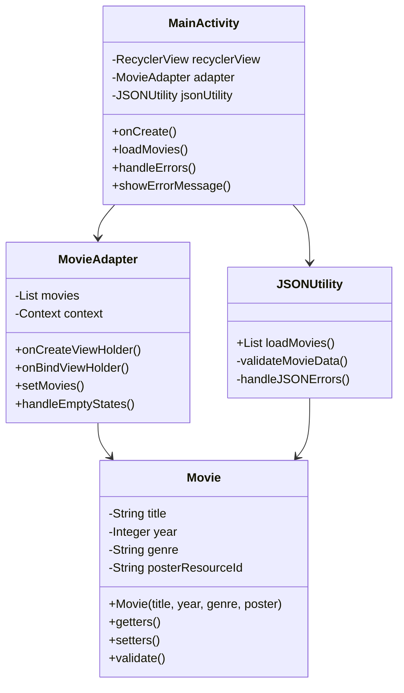
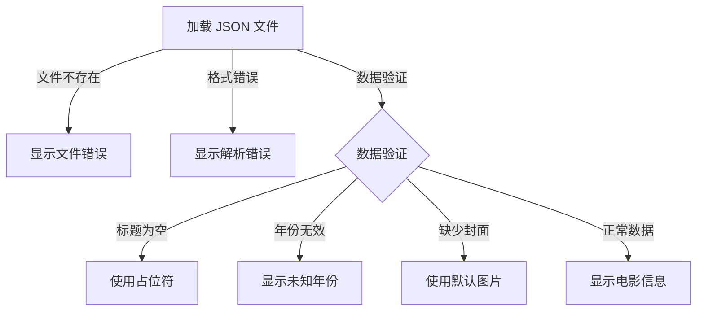

# 电影数据库应用实现计划

## 1. 系统架构

## 2. 实现层次

### 2.1 数据模型层
- Movie 类实现
  - 属性：title, year, genre, poster
  - 数据验证规则：
    - title：非空检查
    - year：有效年份检查（正整数）
    - genre：可选字段
    - poster：资源 ID 验证

### 2.2 数据处理层
- JSONUtility 类实现
  - 文件读取错误处理
  - JSON 解析错误处理
  - 数据验证错误处理
  - 数据转换为 Movie 对象

### 2.3 UI 层
- MovieAdapter 实现
  - ViewHolder 设计
  - 数据绑定逻辑
  - 空状态处理
- MainActivity 实现
  - RecyclerView 配置
  - 数据加载逻辑
  - 错误提示界面

## 3. 错误处理策略

### 3.1 错误处理细节
1. 文件级别错误
   - 文件不存在：显示友好提示，建议用户检查文件位置
   - JSON 格式错误：提示数据格式问题

2. 数据级别错误
   - 标题缺失：显示"未知电影"
   - 年份无效：显示"未知年份"
   - 类型缺失：显示"未分类"
   - 海报缺失：使用默认占位图片

## 4. 实现优先级
1. 基础数据模型实现
2. JSON 解析及错误处理
3. RecyclerView 和适配器实现
4. UI 错误提示实现

## 5. 测试策略
1. 数据验证测试
2. JSON 解析测试
3. UI 显示测试
4. 错误处理测试

## 6. 代码规范
1. 保持代码简洁清晰
2. 添加适当的注释
3. 使用有意义的变量名
4. 遵循 Java 编码规范